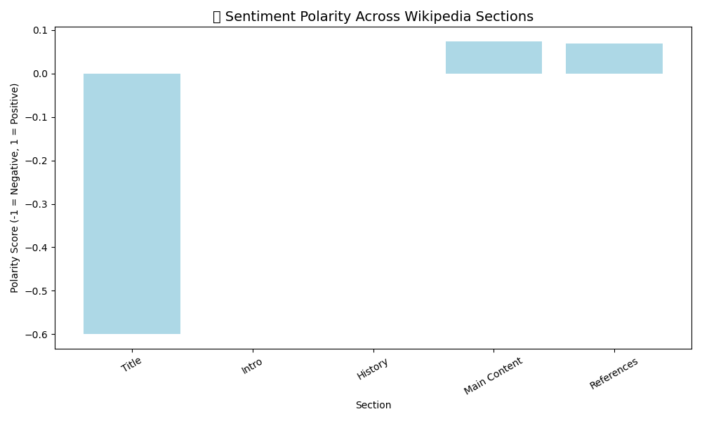
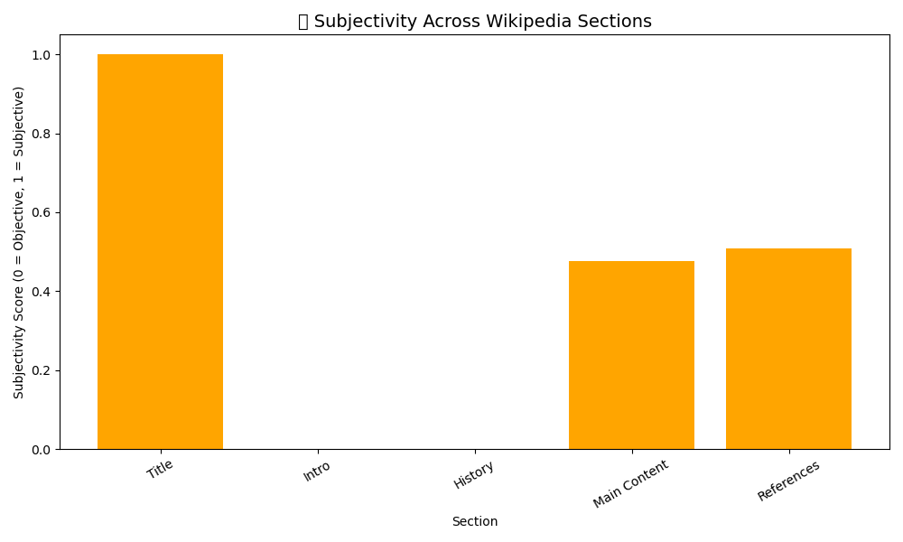

# 🧠 Real-Time Wikipedia NLP Sentiment Analysis

A Natural Language Processing project that scrapes, analyzes, and visualizes sentiment from structured sections of Wikipedia using Python.

---

## 📌 Project Summary

This project was developed for the *Real-Time Big Data Analytics* course at Cal Poly Pomona. It focuses on real-time web/text mining by applying sentiment analysis to content from the Wikipedia page on **Artificial Intelligence**. Using NLP and data visualization, it offers insights into tone and subjectivity across key sections of a popular topic.

---

## 📂 Features

- ✅ Real-time web scraping with BeautifulSoup
- ✅ NLP sentiment scoring using TextBlob
- ✅ Subjectivity and polarity scoring
- ✅ Automatic sentiment labeling (Positive, Negative, Neutral)
- ✅ Word count analytics by section
- ✅ Multiple charts: bar plots and pie visualization
- ✅ Fully documented Jupyter Notebook & PDF export
- ✅ Professional GitHub repo with assets, data, and analysis

---

## 🛠️ Tech Stack

| Tool        | Purpose                       |
|-------------|-------------------------------|
| Python 3    | Core programming language     |
| Jupyter     | Interactive code + commentary |
| TextBlob    | NLP sentiment analysis        |
| BeautifulSoup | Web scraping HTML content   |
| Pandas      | Data analysis & manipulation  |
| Matplotlib  | Visualizations                |

---

## 📊 Output Visuals

<p float="left">
  
  
  
</p>

---

## 🧪 How to Run

1. **Clone the repository:**
```bash
git clone https://github.com/mzskhan626/real-time-wikipedia-nlp-sentiment-analysis.git
cd real-time-wikipedia-nlp-sentiment-analysis
